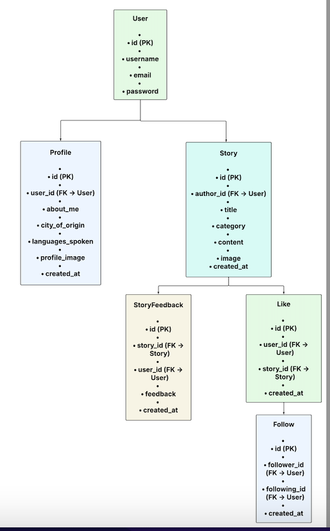

# Storyhubs-Api

Storyhubs is an API built with Django and Django REST Framework. It powers a content-sharing platform where users can register, post stories, like, follow others, and drop feedbacks. This API is designed to be consumed by a React front-end.

## Live Site

The deployed API can be accssed here:  
[here](https://storyhubs-api-4e038dae39bb.herokuapp.com/)

# NOTE 
This is the README for the Backend storyhubs-api. Other information can be found in the Front-end Repository documentation [here](https://github.com/ozi-cheri/storyhubs).

## Table of Contents
- [Project Overview](#project-overview)
- [Agile methodology](#agile-methodology)
- [Wireframes](#wireframes)
- [Technologies used](#technologies-used)
- [Database](#database)
- [Testing](#testing)
- [Deployment](#deployment)
- [Credits](#credits)

## Project Overview

Storyhubs-API is a Django REST Framework backend that powers a storytelling and social interaction platform. It allows users to sign up, post stories, comment on others’ posts, follow profiles, and like content. The API is designed with scalability and security in mind, using PostgreSQL for data storage, JWT for authentication, and Cloudinary for media management. It serves as the backend for a React front-end application and is deployed on Heroku.

## Agile Methodology

This project follows Agile principles to ensure iterative development, user feedback incorporation, and continuous improvement. 

 * Project board can be found [here](https://github.com/users/ozi-cheri/projects/).

 ## Database Schema lucid chart

 - 

## Technologies used

* [Cloudinary](https://cloudinary.com/) was used for photo storage.
* Django REST Framework connects the Front-end to the Back-end.
* Code Institute PostgresSQL Database server was used to store data on profiles,  likes and followers.
* Gunicorn is a Python WSGI HTTP server which was used to run the Django application on Heroku in production.

## Testing

All testing can be found here: [TESTING.md](TESTING.md) 

## Deployment

For detailed deployment steps, see [Deployment.md](DEPLOYMENT.md).

## Credits

- The Code Institute DRF API walkthrough was used to create the storyhubs-api.

